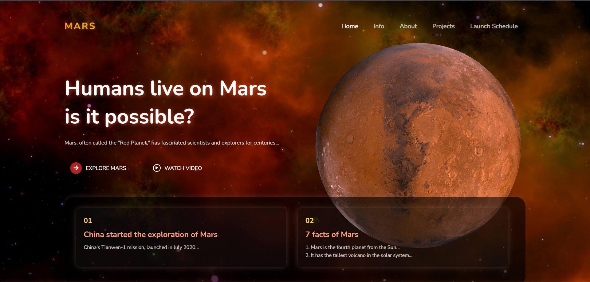

# Flickr Project

A Mars-themed static website built using **HTML** and **CSS**, with animated visuals and interactive layout.

## Features
- Animated Mars and background scaling effect
- Responsive header with navigation links
- Info cards with Mars facts and exploration updates
- Footer with social media icons and creator credit

## How to Use
1. Clone or download the repository.
2. Open `index.html` in your browser.
3. Make sure `images/space.jpg` and `images/mars.png` are in the correct folder.
4. Enjoy exploring the Mars-themed website!

## Screenshot

